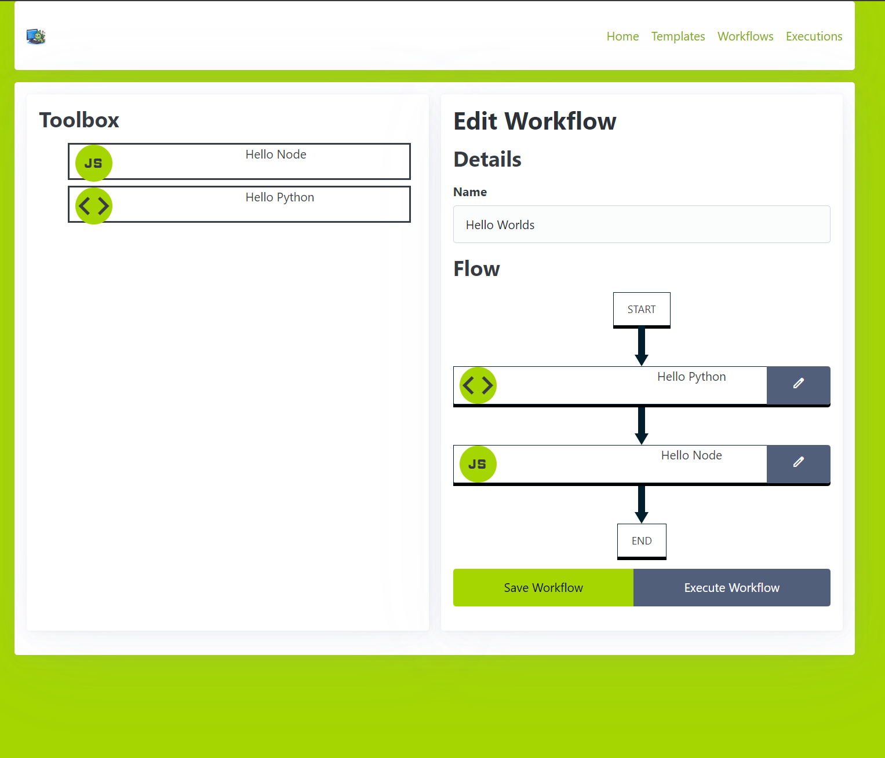

# Executor

## About this tool
This is a system that will allow chaning together multiple scripts in to executions. It can be enqueued by a UI or an API call, making it work well with [FaaSSubMgr](https://github.com/graboskyc/FaaSSubMgr)

## Running
* Edit the `portal/.env` (there is a `sample.env`) to put in the URI for a MongoDB cluster
* Run the `build.sh` script within `portal` folder
* The portal is now running
* Edit the `agent/.env` (there is a `sample.env`) to put in the FQDN of the IP and port the portal server is running on
* Run the `build.sh` script within the `agent` folder
* Everything is now running so you can use the portal to administer tasks

## For advanced usage
* See the FAQ page within the running portal

## Terminology
* **Template** - The reusable building block Tasks comprised of a name, a specified engine, an icon, and an uploaded zip file. It may optionally have additional input parameters that can be specified as user input when put into a Workflow
* **Task** - When a Template is put into a Workflow, it becomes an instantiation of a Template, and thus a Task. It inherits all of the details of the Template, but then when placed into a Workflow it can have its argument values configured
* **Workflow** - A saved collection of Tasks in an order
* **Execution** - A specific instantiation of a Workflow where the entire Workflow is run top to bottom

## Screenshots

### Homepage

### Managing Task Templates

### Managing Workflows (a series of implementations of Tasks)

### Editing a Workflow

### Modifying context of a Task

### Viewing a Workflow's and Task's Execution

### List of Execution Servers

## Context

Yes, an env variable called <code>EXECUTOR</code> is included. You should <code>json.loads(os.environ["EXECUTOR"])</code> to gain access to the format below which is the entire context for the execution:

    <code>
        {
            "_id":{"$oid":"6723ae8ee9ebad747255ff55"},
            "payload":{
                // any additional data you pass in when calling the enqueue API
            },
            "workflowId":"6723a5349df2474dd9315a8a",
            "status":"queued",
            "created":{"$date":"2024-10-31T16:21:34.541Z"},
            "modified":{"$date":"2024-10-31T16:21:34.541Z"},
            "workflow":{"_id":{"$oid":"6723a5349df2474dd9315a8a"},
            "name":"Buncha Hellos",
            "wf":[
                {
                    "_id":{"$oid":"6723a5319df2474dd9315a89"},
                    "title":"Hello World With Time and Env",
                    "engine":"python3",
                    "arguments":[{"key":"key","friendlyName":"value"}],
                    "icon":"code",
                    "gridfspointer":{"$oid":"6723ad020bf8e5e2f1f3dfab"}
                }
            ]
        }
    </code>

Additionally, <code>EXECUTORTASK</code> has just the details for this step:

    <code>
        {
            "_id":{"$oid":"6723a5319df2474dd9315a89"},
            "title":"Hello World With Time and Env",
            "engine":"python3",
            "arguments":[{"key":"key","friendlyName":"value"}],
            "icon":"code",
            "gridfspointer":{"$oid":"6723ad020bf8e5e2f1f3dfab"}
        }
    </code>

Lastly, <code>EXECUTORLASTOUTPUT</code> has the output of the previous command in case you are chaning them:

    <code>
        {
            "response": "big string of whatever was spit out of last command",
            "status": "complete"
        }
    </code>

If all else fails, <code>EXECUTORPORTAL</code> has the IP address or hostname of the Portal. So you can make API calls directly.
