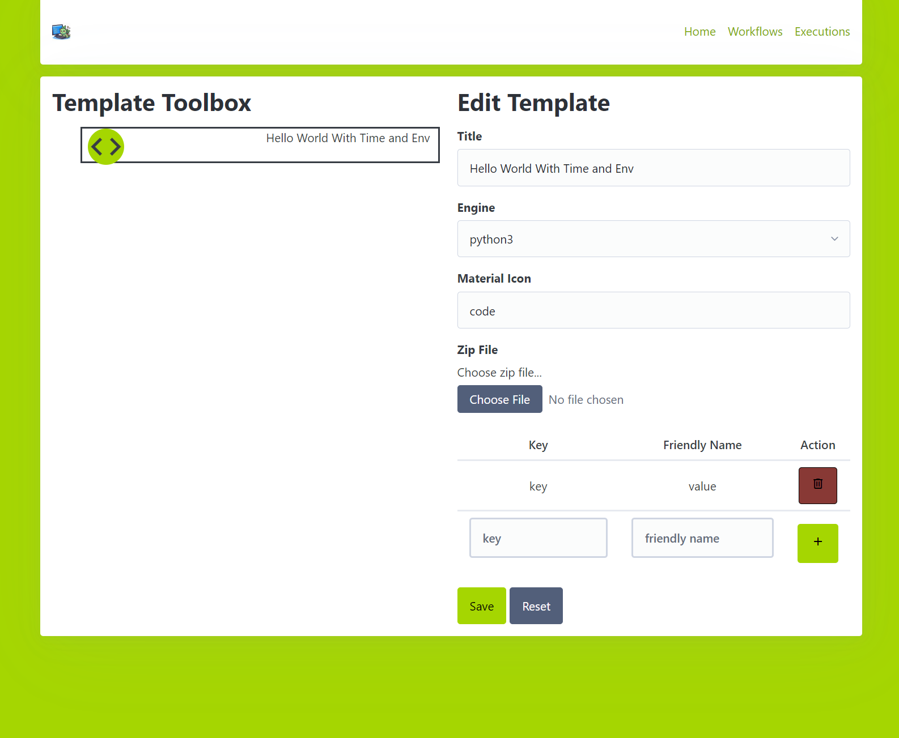

# Executor

## About this tool
This is a system that will allow chaning together multiple scripts in to executions. It can be enqueued by a UI or an API call, making it work well with [FaaSSubMgr](https://github.com/graboskyc/FaaSSubMgr)

## Running
* Edit the `portal/.env` (there is a `sample.env`) to put in the URI for a MongoDB cluster
* Run the `build.sh` script within `portal` folder
* The portal is now running
* Edit the `agent/.env` (there is a `sample.env`) to put in the FQDN of the IP and port the portal server is running on
* Run the `build.sh` script within the `agent` folder
* Everything is now running so you can use the portal to administer tasks

## For advanced usage
* See the FAQ page within the running portal

## Terminology
* **Template** - The reusable building block Tasks comprised of a name, a specified engine, an icon, and an uploaded zip file. It may optionally have additional input parameters that can be specified as user input when put into a Workflow
* **Task** - When a Template is put into a Workflow, it becomes an instantiation of a Template, and thus a Task. It inherits all of the details of the Template, but then when placed into a Workflow it can have its argument values configured
* **Workflow** - A saved collection of Tasks in an order
* **Execution** - A specific instantiation of a Workflow where the entire Workflow is run top to bottom

## Screenshots

### Homepage

### Managing Task Templates

### Managing Workflows (a series of implementations of Tasks)

### Editing a Workflow

### Modifying context of a Task

### Viewing a Workflow's and Task's Execution
