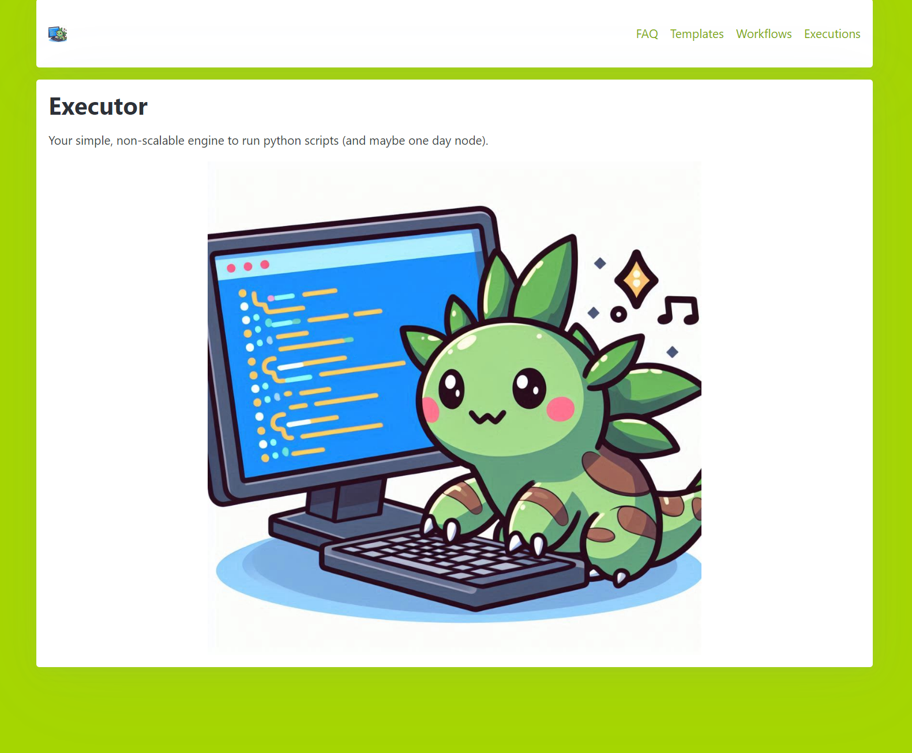
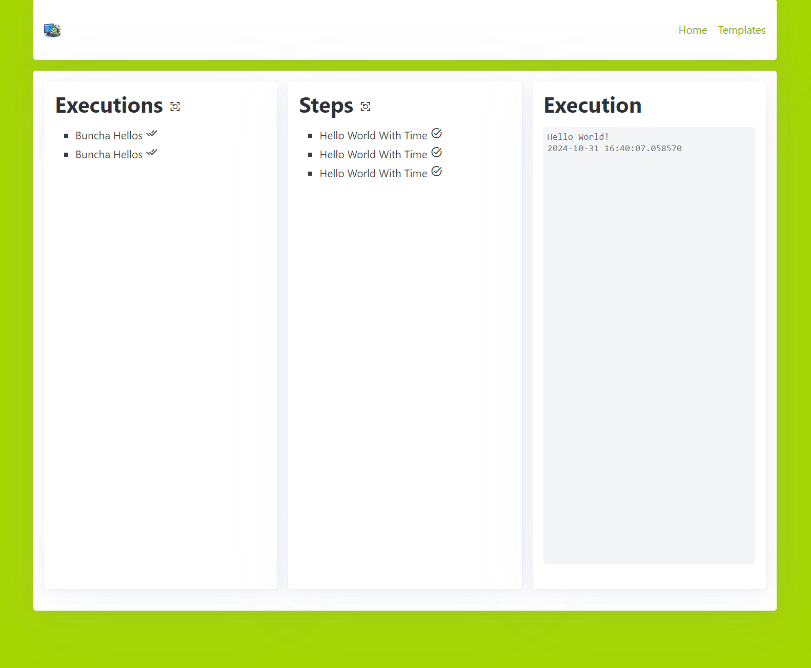

# Executor

## About this tool
This is a system that will allow chaning together multiple scripts in to executions. It can be enqueued by a UI or an API call, making it work well with [FaaSSubMgr](https://github.com/graboskyc/FaaSSubMgr)

## Running
* Edit the `portal/.env` (there is a `sample.env`) to put in the URI for a MongoDB cluster
* Run the `build.sh` script within `portal` folder
* The portal is now running
* Edit the `agent/.env` (there is a `sample.env`) to put in the FQDN of the IP and port the portal server is running on
* Run the `build.sh` script within the `agent` folder
* Everything is now running so you can use the portal to administer tasks

## For advanced usage
* See the FAQ page within the running portal

## Screenshots

